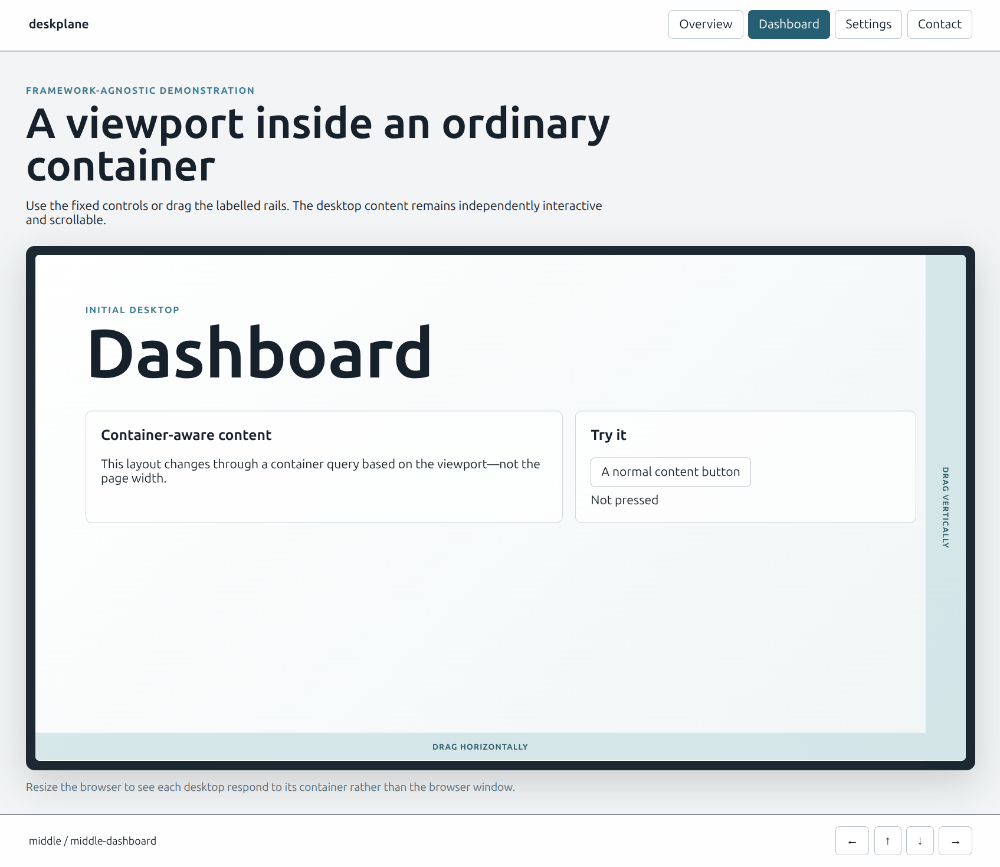

# Deskplane

A framework-agnostic, two-dimensional virtual desktop navigator for the web.

The package owns coordinates, active state, gestures, and movement. Your application owns all content, controls, indicators, and visual design.



Demo: [Codepen](https://codepen.io/editor/judus/pen/01a001fb-11b2-7534-8394-8ee1faa41eab)

> The package is available on [npm](https://www.npmjs.com/package/deskplane).

## Features

- One to three independently positioned rows.
- Any number of desktops within each row.
- Configurable initial desktop, defaulting to the center desktop of the center row.
- Horizontal and vertical movement without diagonal transitions.
- Invisible destination-row pre-alignment before vertical navigation.
- Explicit horizontal, vertical, or two-axis swipe zones.
- Gesture thresholds, flick velocity, transition duration, and easing options.
- External controls with active-state subscriptions.
- Responsive desktop sizing from any mounted viewport element.
- Container-query-ready desktop roots.
- DOM and accessibility state restoration on teardown.
- No runtime dependencies, theme, icons, fonts, or other assets.

## Installation

After publication:

```sh
npm install deskplane
```

Import the controller and the structural stylesheet:

```ts
import { createDeskplane } from "deskplane";
import "deskplane/style.css";
```

## Basic usage

```ts
const deskplane = createDeskplane({
  viewport: document.querySelector("#viewport"),
  rows: [
    {
      id: "top",
      desktops: [
        { id: "overview", element: document.querySelector("#overview") },
        { id: "reports", element: document.querySelector("#reports") },
      ],
    },
    {
      id: "middle",
      desktops: [
        { id: "library", element: document.querySelector("#library") },
        { id: "home", element: document.querySelector("#home") },
        { id: "settings", element: document.querySelector("#settings") },
      ],
    },
    {
      id: "bottom",
      desktops: [
        { id: "contact", element: document.querySelector("#contact") },
      ],
    },
  ],
  initialDesktopId: "home",
  transition: {
    duration: 320,
    easing: "cubic-bezier(0.22, 1, 0.36, 1)",
  },
});

await deskplane.goTo("settings");
await deskplane.move("up");
```

The example omits application-specific null checks for readability. TypeScript users should resolve and validate their elements before passing them to the package.

The supplied desktop elements are moved into the viewport while the controller is active. `destroy()` restores their original DOM positions, relevant attributes, and inert state.

## React adapter

React applications can use the optional `deskplane/react` entry point:

```tsx
import { useState } from "react";
import { DeskplaneViewport } from "deskplane/react";
import type { Deskplane } from "deskplane";
import "deskplane/style.css";

export function ApplicationDesktops() {
  const [deskplane, setDeskplane] = useState<Deskplane>();

  return (
    <>
      <button onClick={() => void deskplane?.goTo("controls")}>Controls</button>
      <button onClick={() => void deskplane?.goTo("information")}>Info</button>

      <DeskplaneViewport
        className="application-viewport"
        initialDesktopId="information"
        onReady={(controller) => {
          setDeskplane(controller);
          return () => setDeskplane(undefined);
        }}
        rows={[
          {
            id: "main",
            desktops: [
              { id: "controls", children: <Controls /> },
              { id: "information", children: <Information /> },
              { id: "copilot", children: <Copilot /> },
            ],
          },
        ]}
      />
    </>
  );
}
```

The adapter has no application or routing assumptions. It creates the desktop containers and renders application content into them through React portals. React retains ownership of every component tree while the framework-agnostic Deskplane core owns positioning, gestures, and navigation state.

React and React DOM are optional peer dependencies: applications using only the core package do not need either framework.

## External controls

Controls can live anywhere in the document. A control only needs a target desktop id:

```ts
const button = document.querySelector("#settings-button");

button.addEventListener("click", () => {
  void deskplane.goTo("settings");
});

const unsubscribe = deskplane.subscribe((snapshot) => {
  const active = snapshot.activeDesktopId === "settings";
  button.setAttribute("aria-pressed", String(active));
});
```

Subscriptions receive the current snapshot immediately and again when navigation state changes. They are independent of any UI framework.

## Swipe zones

Gestures begin only on explicit swipe zones, preventing competition with forms, buttons, and scrollable application content.

Declarative zones are discovered within the viewport when the controller is created:

```html
<div data-deskplane-swipe-zone="horizontal">Drag left or right</div>
<div data-deskplane-swipe-zone="vertical">Drag up or down</div>
<div data-deskplane-swipe-zone>Drag in either direction</div>
```

Zones can instead be supplied explicitly:

```ts
createDeskplane({
  viewport,
  rows,
  gestures: {
    zones: [
      { element: horizontalHandle, axes: "horizontal" },
      { element: verticalHandle, axes: "vertical" },
    ],
    lockThreshold: 8,
    distanceThreshold: 0.18,
    velocityThreshold: 0.5,
  },
});
```

The structural stylesheet applies `touch-action: none` only to swipe zones. Normal desktop content therefore keeps its native touch, scrolling, selection, and form behavior. Common interactive controls and `[data-deskplane-no-swipe]` are also ignored if nested inside a zone.

An ordinary tap button may opt into swipes starting on it:

```html
<button data-deskplane-swipe-through>Open controls</button>
```

Without a drag, its normal click handler runs. Once the gesture locks past `lockThreshold`,
Deskplane suppresses the associated pointer click, including when the swipe snaps back or
is cancelled. Keyboard activation and the next tap are unaffected. The marker only opts a
button out of the **default** button exclusion; other default exclusions, including
`data-deskplane-no-swipe` ancestors, still apply. A custom `gestures.ignore` replaces the
default selector, so retain any required exclusions there. Do not opt in buttons that execute on
pointer-down, hold to run/arm, or own an editing drag. Applications must preserve the zone's
touch policy through nested scroll owners, while excluded map/control surfaces retain their
own touch policy.

## Container queries

Every mounted `.deskplane-desktop` is a size container. Application content can react to the actual viewport dimensions:

```css
.account-desktop {
  container-name: account;
}

@container account (min-width: 42rem) {
  .account-layout {
    grid-template-columns: 2fr 1fr;
  }
}
```

## API summary

`createDeskplane(options)` returns:

- `snapshot` — active row, active desktop, each row's remembered desktop, and animation state.
- `goTo(desktopId)` — navigate directly to an associated desktop.
- `move(direction)` — move `up`, `right`, `down`, or `left`; resolves to `false` at an edge.
- `isActive(desktopId)` — check whether a desktop is active.
- `subscribe(listener)` — observe state and receive an unsubscribe function.
- `destroy()` — remove package DOM and listeners and restore supplied elements.

Invalid layouts, duplicate ids, duplicate elements, unknown desktop ids, and more than three rows fail early with descriptive errors.

## Demo

Run the one included demonstration:

```sh
npm run dev
```

It demonstrates a non-fullscreen viewport, unequal row lengths, fixed external controls, active-state reflection, swipe rails, container queries, normal buttons, forms, and scrollable content.

## Development and quality checks

Install dependencies and run the complete quality gate:

```sh
npm install
npm run check
```

`npm run check` verifies Prettier formatting, type-aware ESLint rules, strict TypeScript types, Vitest tests, the distributable package build, and the production demo build.

Pure navigation and state transitions are covered by fast unit tests. DOM mounting, restoration, active state, row pre-alignment, and pointer gestures are tested in a browser-like DOM. Real-browser visual checks cover responsive rendering and container behavior.

Other commands:

```sh
npm run format
npm run lint
npm run typecheck
npm test
npm run test:watch
npm run build
npm run build:demo
```

## License

[MIT](LICENSE)
